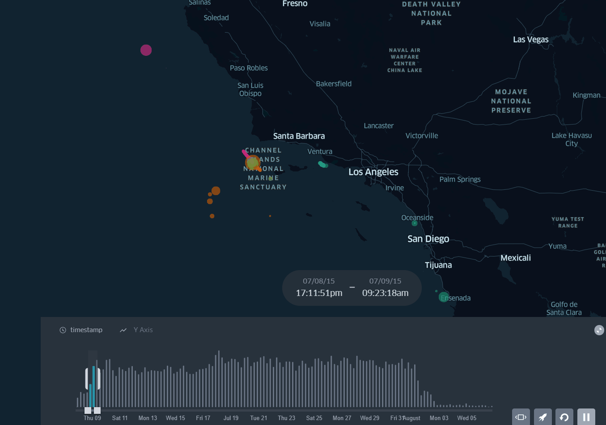

# ***Stop detection algorithm with Whale GPS tracking***

This repository is part of the Medium post: https://towardsdatascience.com/stop-detection-in-blue-whales-gps-tracking-movingpandas-0-6-55a4b893a592

The final map animation of the whale tracks and the stop's duration here: https://bryanvallejo16.github.io/stop-detection-whale-tracking/

# ***DEMO***

## ***Details about the dataset***

The dataset was published in Movebank. The details here: https://www.movebank.org/cms/webapp?gwt_fragment=page=studies,path=study943824007

